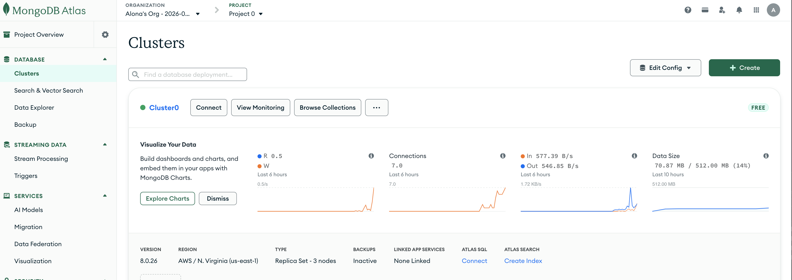
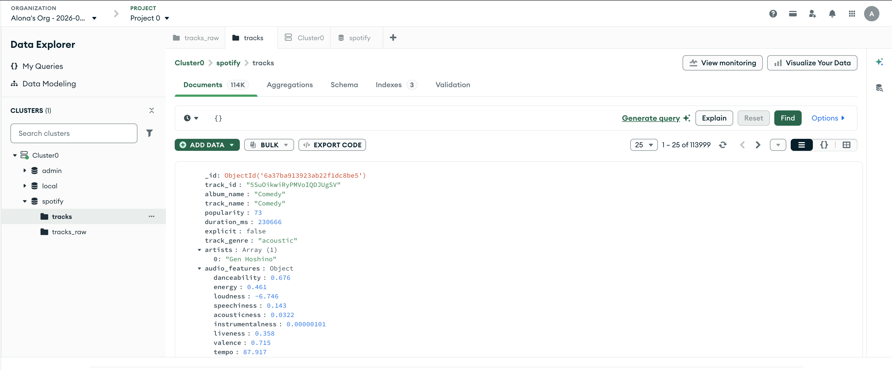
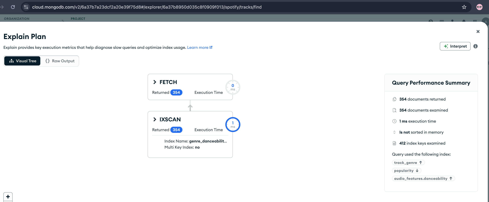
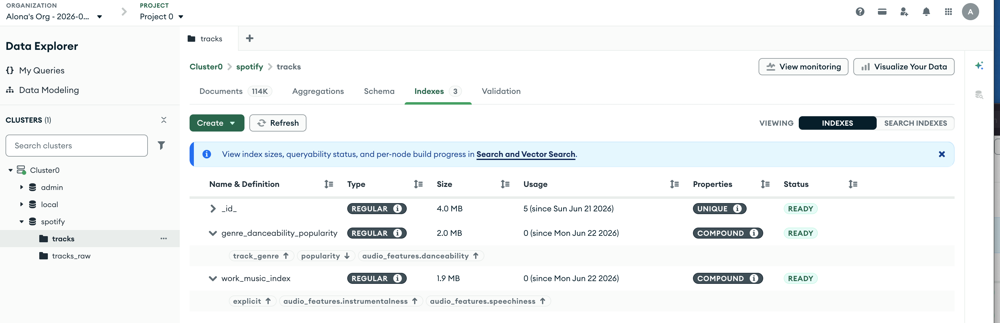
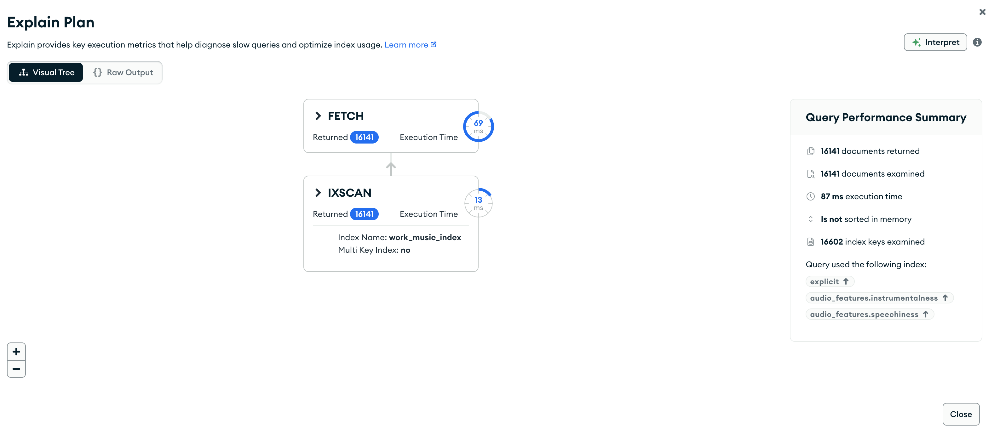
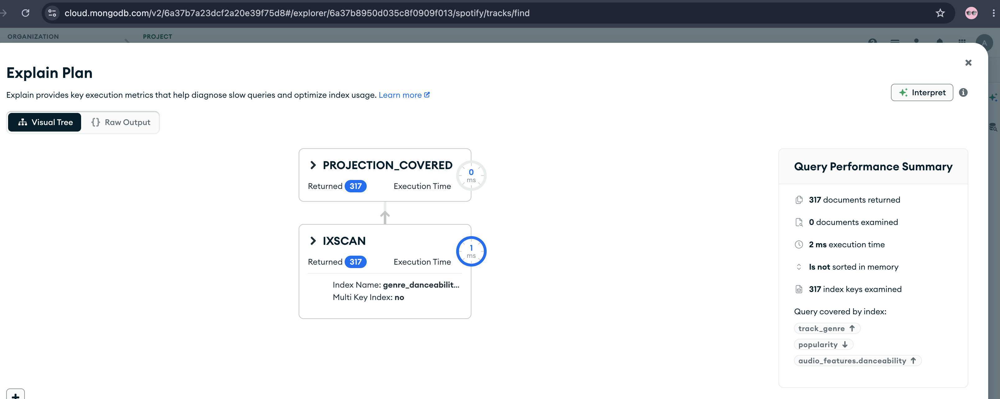

# Spotify MongoDB — Домашнє завдання NoSQL

## Структура проекту

```
nosql/
├── scripts/
│   ├── 01_load_data.py       # Завантаження CSV у колекцію tracks_raw
│   └── 02_transform.js       # Трансформація tracks_raw → tracks
├── queries/
│   ├── part2_queries.js      # Частина 2 — запити до даних
│   ├── part3_analytics.js    # Частина 3 — аналітика
│   └── part4_indexes.js      # Частина 4 — індекси та explain()
├── screenshots/
│   ├── atlas_cluster.png              # Кластер Atlas
│   ├── part1_schema_document.png      # Документ колекції tracks
│   ├── part4_atlas_indexes.png        # Список індексів в Atlas
│   ├── part4_explain_after.png        # explain() після індексу (4.1)
│   ├── part4_explain_work_music.png   # explain() work_music_index (4.2)
│   ├── part4_explain_covered.png      # explain() covered query (4.3)
│   └── terminal_part4.txt             # Вивід part4_indexes.js з термінала
├── .env                      # MONGO_URI (не в git)
├── .env.example              # Шаблон для .env
├── requirements.txt          # Python залежності
└── README.md
```

---

## Налаштування оточення

### Передумови

- Python 3.8+
- [mongosh](https://www.mongodb.com/try/download/shell)
- Акаунт [MongoDB Atlas](https://www.mongodb.com/atlas) (безкоштовний тир M0)
- Акаунт [Kaggle](https://www.kaggle.com)

### Кроки налаштування

**1. Встановіть залежності:**
```bash
pip install -r requirements.txt
```

**2. Налаштуйте MongoDB Atlas:**
- Зареєструйтесь на [mongodb.com/atlas](https://mongodb.com/atlas)
- Створіть кластер M0 (AWS, найближчий регіон)
- Database Access → створіть користувача з паролем
- Network Access → додайте свій IP (або `0.0.0.0/0`)
- Connect → Drivers → скопіюйте рядок підключення



**3. Заповніть `.env`:**
```bash
cp .env.example .env
# Відредагуйте .env і вставте ваш рядок підключення
```

**4. Завантажте датасет з Kaggle:**
```bash
kaggle datasets download maharshipandya/-spotify-tracks-dataset
unzip -j \*.zip dataset.csv
```

**5. Запустіть скрипти у порядку:**
```bash
# 1. Завантаження сирих даних (~114k треків → колекція tracks_raw)
python scripts/01_load_data.py

# 2. Трансформація схеми (tracks_raw → колекція tracks)
mongosh "$MONGO_URI" --file scripts/02_transform.js

# 3. Запити (Частина 2)
mongosh "$MONGO_URI" --file queries/part2_queries.js

# 4. Аналітика (Частина 3)
mongosh "$MONGO_URI" --file queries/part3_analytics.js

# 5. Індекси (Частина 4)
mongosh "$MONGO_URI" --file queries/part4_indexes.js
```

---

## Схема даних — колекція `tracks`



```json
{
  "_id": { "$oid": "..." },
  "track_id": "7qiZfU4dY1lWllzX7mPBI3",
  "track_name": "Shape of You",
  "album_name": "÷ (Divide)",
  "artists": ["Ed Sheeran"],
  "explicit": false,
  "popularity": 87,
  "duration_ms": 233713,
  "duration_sec": 233.7,
  "track_genre": "pop",
  "popularity_tier": "high",
  "audio_features": {
    "danceability": 0.825,
    "energy": 0.652,
    "loudness": -3.183,
    "speechiness": 0.0802,
    "acousticness": 0.581,
    "instrumentalness": 0.0,
    "liveness": 0.0931,
    "valence": 0.931,
    "tempo": 95.977,
    "key": 1,
    "mode": 0,
    "time_signature": 4
  }
}
```

---

## Теоретичні питання

### Частина 1 — Завантаження даних та проєктування схеми

**1. Чому аудіо-характеристики винесені в окремий об'єкт `audio_features`, а не зберігаються плоско?**

Вкладення вигідне з кількох причин:

- **Семантичне групування.** Усі 12 полів (`danceability`, `energy`, `tempo` тощо) описують звуковий профіль треку — це одна логічна одиниця. Структура документа одразу зрозуміла: верхній рівень — ідентифікатори та метадані треку, `audio_features` — звукові метрики.
- **Спрощена проєкція.** Щоб отримати лише аудіо-метрики, достатньо `{ audio_features: 1 }` замість перерахування 12 полів.
- **Читабельність.** З першого погляду на документ видно де основні дані треку, а де технічні характеристики звуку.

**Коли вкладення створює проблеми:**
- Для кожного поля всередині об'єкта потрібен окремий індекс із повним шляхом (`"audio_features.danceability"`), що трохи довше і займає більше місця.
- Деякі інструменти аналізу (pandas, BI-конектори) очікують плоскої структури і потребують додаткового розгортання.

**2. Чому виконавці зберігаються як масив, а не як рядок?**

Треки часто мають кількох виконавців (колаборації). Масив дозволяє:

- **Простий та точний пошук:** `{ artists: "Drake" }` знайде всі треки де Drake є одним із виконавців — MongoDB автоматично перевіряє кожен елемент масиву.
- **Безпека від помилок:** рядковий пошук через `$regex: "Drake"` міг би знайти виконавця "Sir Francis Drake".
- **Агрегація:** `$unwind: "$artists"` → `$group: { _id: "$artists" }` дозволяє рахувати кількість треків та середню популярність по кожному артисту — саме це використовується в Завданнях 2 і 3 Частин 2–3.

**3. Що таке `$out` і чим він відрізняється від `$merge`?**

| | `$out` | `$merge` |
|---|---|---|
| Дія | Повністю замінює колекцію | Оновлює/додає документи |
| Атомарність | Так — читачі бачать або стару, або нову версію | Ні — поступовий запис |
| Якщо pipeline падає | Стара колекція залишається | Частина документів вже записана |
| Запис у ту ж колекцію-джерело | Не підтримується | Підтримується |
| Гнучкість | Лише "замінити все" | `merge`, `replace`, `keepExisting`, `fail` |

**Коли `$out`:** повний ETL, матеріалізовані view, ідемпотентні трансформації де потрібна атомарність. У нашому завданні `tracks_raw` → `tracks` — правильний вибір.

**Коли `$merge`:** інкрементальні оновлення, upsert-сценарії, коли частину документів не треба перезаписувати.

---

### Частина 2 — Запити до даних

**1. Для чого використовується інструкція `$unwind`?**

`$unwind` "розгортає" масив: документ з `artists: ["A", "B"]` стає двома окремими документами — по одному на кожного артиста:

```
{ artists: ["A", "B"] }  →  { artists: "A" }, { artists: "B" }
```

Без `$unwind`, `$group: { _id: "$artists" }` групував би по всьому масиву як єдиному ключу — `["A", "B"]` і `["B", "A"]` потрапили б у різні групи замість об'єднання за іменем артиста.

У Завданні 2: `$unwind: "$artists"` → `$group: { _id: "$artists" }` дозволяє порахувати кількість треків та мінімальну популярність кожного виконавця окремо.

**2. Чим `$stdDevPop` відрізняється від `$stdDevSamp`?**

- **`$stdDevPop`** — стандартне відхилення генеральної сукупності, ділить на **N**.
- **`$stdDevSamp`** — стандартне відхилення вибірки, ділить на **N-1** (поправка Бесселя, незміщена оцінка).

У Завданні 3 (Частина 2) обираємо `$stdDevPop`: ми аналізуємо всі треки жанру в датасеті — це і є повна генеральна сукупність, а не вибірка з неї. При сотнях треків на жанр різниця мінімальна, але семантично `$stdDevPop` коректніший.

---

### Частина 3 — Аналітика

**1. Як зміниться результат при зміні порогу кількості треків?**

*Поріг 1:* Будь-який виконавець з хоча б одним треком включається. Артист з єдиним треком і популярністю 100 потрапляє в топ — результат спотворений "разовими" записами без статистичної значущості.

*Поріг 5 (поточний):* Базовий рівень надійності. П'ять треків дозволяють оцінити стабільну популярність артиста.

*Поріг 50:* Залишаються лише дуже продуктивні виконавці. Середня популярність стабільніша, але у списку можуть домінувати артисти з фонових плейлистів ("Relaxing Music", сотні треків) замість популярних виконавців із невеликою дискографією.

**2. Чи зміниться результат при зниженні порогу жанру до 50 треків?**

Так, можуть з'явитися нові жанри з 50–99 треками. Для жанру з лише 60 треками середнє `danceability` менш надійне — кілька треків-аутлайєрів можуть суттєво зрушити результат. Якщо при порозі 50 і 100 топ-жанри збігаються — результат стабільний. Якщо різняться — жанри з 50–99 треками спотворюють рейтинг.

---

## Частина 4 — Аналіз індексів

### Завдання 4.1

**Запит:**
```javascript
db.tracks.find({
  track_genre: "pop",
  "audio_features.danceability": { $gte: 0.7 }
}).sort({ popularity: -1 })
```

#### explain() ДО індексу

```
{
  stage: 'SORT',
  totalDocsExamined: 113999,
  totalKeysExamined: 0,
  executionTimeMillis: 134,
  nReturned: 354
}
```

#### Створення індексу

```javascript
db.tracks.createIndex(
  { track_genre: 1, popularity: -1, "audio_features.danceability": 1 },
  { name: "genre_danceability_popularity" }
)
```

#### explain() ПІСЛЯ індексу

```
{
  stage: 'FETCH',
  inputStageStage: 'IXSCAN',
  indexName: 'genre_danceability_popularity',
  totalDocsExamined: 354,
  totalKeysExamined: 412,
  executionTimeMillis: 2,
  nReturned: 354
}
```

#### Що змінилося в плані виконання?

**До індексу:** `stage: "SORT"` (повне сканування колекції + сортування в пам'яті), `totalDocsExamined: 113999`, `totalKeysExamined: 0`, `executionTimeMillis: 134`.

**Після індексу:** `stage: "FETCH"` з `inputStage.stage: "IXSCAN"`, `totalDocsExamined: 354`, `totalKeysExamined: 412`, `executionTimeMillis: 2`.

**Як зрозуміти що індекс використовується:**
- `totalDocsExamined` впав з 113 999 до 354 — MongoDB більше не сканує всю колекцію
- `totalKeysExamined: 412` — з'явилося сканування ключів індексу (раніше було 0)
- `indexName: 'genre_danceability_popularity'` — підтверджує який індекс використано
- Час виконання скоротився з 134 мс до 2 мс





---

### Завдання 4.2

```javascript
db.tracks.createIndex(
  {
    explicit: 1,
    "audio_features.instrumentalness": 1,
    "audio_features.speechiness": 1
  },
  { name: "work_music_index" }
)
```

```
{
  stage: 'FETCH',
  inputStageStage: 'IXSCAN',
  indexName: 'work_music_index',
  totalDocsExamined: 16141,
  totalKeysExamined: 16602,
  nReturned: 16141
}
```

Порядок полів відповідає **ESR-правилу** (Equality → Sort → Range): `explicit` (точна рівність) стоїть першим, `instrumentalness` і `speechiness` (range-умови) — після.

`inputStage.stage: "IXSCAN"` та `indexName: "work_music_index"` підтверджують використання індексу.



---

### Завдання 4.3 — Покривний запит (Covered Query)

**Індекс з Завдання 1:** `{ track_genre: 1, popularity: -1, "audio_features.danceability": 1 }`

Запит `db.tracks.find({ track_genre: "pop", popularity: { $gte: 70 } })` **без проєкції — НЕ покривний**, бо MongoDB має повернути ВСІ поля документа, а індекс містить тільки 3 поля. В explain видно `stage: "FETCH"`, `totalDocsExamined: 317`.

```
{
  stage: 'FETCH',
  inputStageStage: 'IXSCAN',
  totalDocsExamined: 317,
  totalKeysExamined: 317,
  nReturned: 317
}
```

Але якщо додати проєкцію тільки по полях що є в індексі і прибрати `_id`:

```javascript
db.tracks.find(
  { track_genre: "pop", popularity: { $gte: 70 } },
  { _id: 0, track_genre: 1, popularity: 1 }
)
```

то запит стає покривним:

- `stage: "PROJECTION_COVERED"` — MongoDB знає що все є в індексі
- `totalDocsExamined: 0` — жодного звернення до колекції
- Немає `FETCH` — вся інформація з індексу

```
{
  stage: 'PROJECTION_COVERED',
  totalDocsExamined: 0,
  totalKeysExamined: 317,
  nReturned: 317
}
```

По суті покривний запит швидший тому що індекс компактніший за повні документи і зазвичай повністю в RAM.


